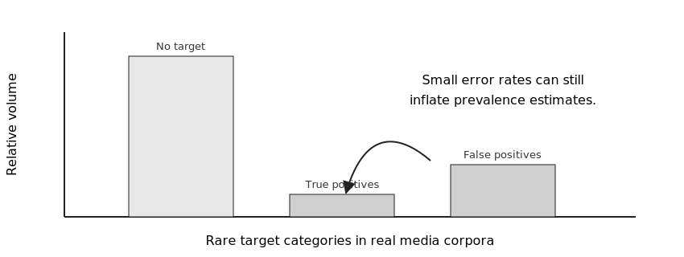

**Navigation:** [Home](index.html) · [1 Scope](01-scope-and-design.html) · [2 Codebook](02-codebook-and-annotation.html) · [3 Data](03-data-preparation.html) · [4 Model choice](04-model-selection.html) · [5 LLM prompting](05-prompting-llms.html) · [6 Fine-tuning](06-fine-tuning-slms.html) · [7 Evaluation](07-evaluation-validation.html) · [8 Reporting](08-reporting-reproducibility.html) · [Checklists](09-checklists.html) · [Links](resources.html) · [References](references.html)

# 1. Scope and design

The first methodological decision is whether the target category is measurable with the available text, unit of analysis, and validation resources. In communication science, many categories are latent and theory-laden. A model may output labels for them, but that does not mean the labels measure the construct.

## Define the measurement object

Before collecting or modelling data, write down:

| Decision | Questions to settle | Typical FLACA lesson |
|---|---|---|
| Construct | Is this a topic, stance, claim, argument, frame, value, actor, or relation? | Stance is often easier than fine-grained arguments or frames. |
| Target | What is the stance *toward*? What is the frame *of*? | Target ambiguity produces label ambiguity. |
| Coding unit | Sentence, paragraph, article, post, thread, or multimodal item? | Sentence-level units may still need surrounding context. |
| Context | How much context is necessary for a human coder? | Give the model the same context when possible. |
| Quantity of interest | Prevalence, trend, outlet comparison, actor association, diversity index, or regression variable? | Evaluation must match the downstream use. |

## Suitable and unsuitable categories

A category is a good first candidate for automation when it is frequent enough to validate, has mutually exclusive rules, and can be identified by trained humans with acceptable reliability. It is a risky candidate when it depends on implicit irony, highly specialized background knowledge, long discourse context, or contested theoretical boundaries.

A useful rule is: **if trained coders cannot consistently apply the codebook after discussion, do not expect a model to solve the problem without re-operationalization.**

## Choose a design before a model

Do not start from “we will use GPT” or “we will fine-tune BERT.” Start from the measurement design:

1. Define the construct and its theoretical role.
2. Decide the coding unit and context window.
3. Draft human-readable coding rules.
4. Pilot manual coding.
5. Estimate prevalence and class imbalance.
6. Decide whether the output will support descriptive estimates, comparisons, or downstream statistical inference.
7. Only then choose a model family.

## Minimum scope statement

Use this paragraph template in preregistrations, methods appendices, and project notes:

> We classify **[unit]** from **[corpus]** into **[labels]** to measure **[construct]** for the purpose of **[quantity of interest]**. Each unit includes **[context]**. Labels are defined by **[codebook/version]** and validated against **[gold-standard sample]**. The final analysis uses model predictions only for **[permitted uses]** and does not interpret them as **[excluded meanings]**.

## Practical warning

For rare categories, a small false-positive rate can create a large substantive distortion. This is especially important for claims, arguments, frames, and other categories that may appear in only a small share of all sentences or paragraphs.

*Figure 2. Original conceptual figure, CC0/public domain dedication.*
