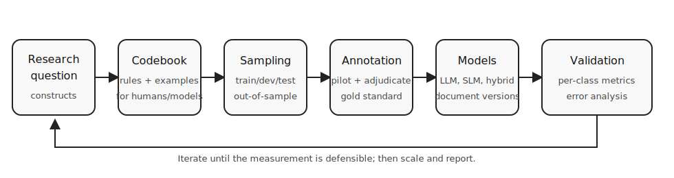

**Navigation:** [Home](index.html) · [1 Scope](01-scope-and-design.html) · [2 Codebook](02-codebook-and-annotation.html) · [3 Data](03-data-preparation.html) · [4 Model choice](04-model-selection.html) · [5 LLM prompting](05-prompting-llms.html) · [6 Fine-tuning](06-fine-tuning-slms.html) · [7 Evaluation](07-evaluation-validation.html) · [8 Reporting](08-reporting-reproducibility.html) · [Checklists](09-checklists.html) · [Links](resources.html) · [References](references.html)

# Best Practice Tutorial for Automated Content Analysis in Communication Science

This tutorial distills the methodological lessons from FLACA (*Few-shot Learning for Automated Content Analysis in Communication Science*) into a compact workflow for communication scholars who want to classify complex textual categories such as stances, claims, arguments, frames, actor types, or value references. It is designed as a GitHub Pages companion to the FLACA notebooks and can be read as a practical checklist before building a pipeline.

*Figure 1. Original workflow figure, CC0/public domain dedication.*

## Core message

Automated content analysis is not primarily a model-selection problem. It is a measurement-design problem. FLACA shows that transformer-based models and LLMs can make semantically demanding content analysis scalable, but results become defensible only when the study design accounts for concept ambiguity, class imbalance, context dependence, and out-of-sample generalization.

## Ten principles

1. **Start with the construct, not the model.** Define the theoretical category before choosing BERT, XLM-R, GPT, Llama, or any other model.
2. **Translate the codebook twice.** A good codebook must guide human coders and be operationalized as model input.
3. **Choose the coding unit deliberately.** Sentences, paragraphs, documents, posts, and image-text pairs produce different measurement objects.
4. **Preserve needed context.** If human coders need surrounding sentences, the model should usually receive them too.
5. **Expect imbalance.** In real media corpora, meaningful categories are often rare; accuracy alone is therefore misleading.
6. **Use human annotation strategically.** Small, high-quality validation sets are more valuable than large unvalidated model outputs.
7. **Benchmark more than one approach.** Compare at least a simple baseline, a prompted LLM, and a supervised or fine-tuned approach when resources permit.
8. **Evaluate per class and out of sample.** A model that works on a balanced test set may fail on realistic corpus distributions.
9. **Inspect errors substantively.** False positives and false negatives often reveal conceptual ambiguity, not only model failure.
10. **Report enough to reproduce the measurement.** Publish prompts, codebook versions, model versions, seeds, sampling decisions, and validation results.

## Tutorial map

| Page | Main question | Output |
|---|---|---|
| [1. Scope and design](01-scope-and-design.html) | What exactly should be measured? | Measurement plan |
| [2. Codebook and annotation](02-codebook-and-annotation.html) | How do humans and models learn the category? | Codebook + gold set |
| [3. Data preparation](03-data-preparation.html) | How should corpus, units, and context be prepared? | Reproducible dataset splits |
| [4. Model selection](04-model-selection.html) | Which model family fits the task? | Model decision |
| [5. LLM prompting](05-prompting-llms.html) | How can LLMs be used without over-trusting them? | Prompt protocol |
| [6. Fine-tuning SLMs](06-fine-tuning-slms.html) | When is supervised adaptation preferable? | Training protocol |
| [7. Evaluation and validation](07-evaluation-validation.html) | How do we know the measurement is valid? | Validation report |
| [8. Reporting and reproducibility](08-reporting-reproducibility.html) | What must be disclosed? | Methods appendix |
| [Checklists](09-checklists.html) | What should be checked before scaling/publishing? | Practical checklist |
| [Links](resources.html) | Where are useful resources? | Curated resources |

## How this tutorial relates to FLACA

The FLACA repository contains six Jupyter notebooks that move from Python basics through supervised classification, zero-shot classification, domain adaptation, LLM prompting, and final prediction/analysis. This tutorial is complementary: it explains the design logic behind such pipelines and translates the project results into reusable best-practice advice.
